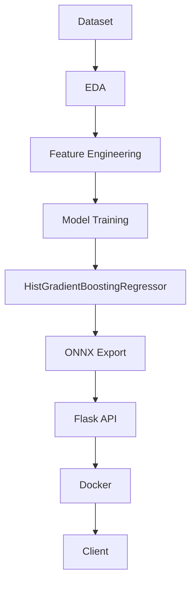

# Library Rentals Demand Forecasting | ONNX Inference Service

   

## Executive Summary
This repository implements a compact, production-oriented inference service for library rental demand forecasting. A regression model trained in a notebook is exported to ONNX and served through a Flask API. The project demonstrates a focused workflow for taking a tabular model from experimentation to a simple serving layer.

The current implementation is intentionally lightweight. It focuses on one core task: receive a feature payload, align it to the model schema, run inference with ONNX Runtime, and return a prediction.

## Business Problem
Library operations teams often need to estimate demand at a fine-grained level so they can plan staffing, inventory, and service capacity. This project addresses that need by providing a machine learning inference endpoint for rental demand prediction based on contextual features such as time, weather, branch, category, and membership type.

## Solution Overview
The solution combines a trained regression model with a minimal serving layer:

1. A notebook trains and evaluates candidate regression models.
2. The selected model is exported to ONNX for portable inference.
3. A Flask application loads the ONNX model and exposes a POST endpoint for predictions.
4. The service is packaged with Docker for repeatable deployment.

## Project Architecture


## Machine Learning Pipeline
The repository follows a straightforward machine learning workflow:

1. Explore and prepare the rental demand dataset in the notebooks.
2. Train and compare several regression models.
3. Select the optimized HistGradientBoosting model for deployment.
4. Export the model to ONNX.
5. Serve the exported model through a Flask endpoint.

The training work is documented in the notebooks under the Notebooks directory. The repository itself contains the exported ONNX artifact and the serving application.

## Feature Engineering
The inference service relies on a fixed schema of 44 model input features. The application constructs a one-row DataFrame from the incoming request and performs the following steps:

- Derives Temp_Humidity_Interaction as Temperature_C multiplied by Humidity_pct.
- Reindexes the DataFrame to the exact feature order expected by the model.
- Fills missing fields with 0 so that the input shape and column order remain consistent.

This is an important engineering decision because the ONNX model expects a specific input structure. The reindexing step protects the service from column-order drift and missing-feature issues that would otherwise produce invalid predictions.

## Model Selection
The notebook evaluates multiple regression approaches, including linear regression, decision trees, random forests, neural networks, and HistGradientBoosting. The final deployed model is an optimized HistGradientBoostingRegressor configured with:

- max_iter=300
- learning_rate=0.05
- max_depth=10
- random_state=42

This choice is appropriate for the problem because the dataset is structured tabular data and the model can capture nonlinear relationships without requiring the full training stack at inference time.

## Model Performance
The repository includes the training and evaluation workflow in the notebooks, including model comparison logic. The saved artifacts in this repository do not include a separate persisted benchmark report, so the exact numerical metrics should be reviewed directly in the notebooks if needed.

## Inference Pipeline
The runtime flow in app.py is intentionally simple:

1. The API receives a JSON payload via POST /predict.
2. The payload is converted into a pandas DataFrame.
3. The derived interaction feature is added.
4. The DataFrame is aligned to EXPECTED_COLUMNS using reindex.
5. The aligned values are converted to float32 and sent to ONNX Runtime.
6. The model output is returned as JSON.

The service currently supports single-record inference. It does not implement batching or asynchronous processing.

## MLOps Components
This repository includes several basic MLOps building blocks:

- Versioned notebook workflow for experimentation.
- Serialized model artifact in ONNX format.
- A lightweight serving API for model inference.
- Containerization with Docker for environment consistency.
- A simple Git-based repository structure for collaboration and change tracking.

## Engineering Decisions

| Decision | Reason |
| --- | --- |
| HistGradientBoostingRegressor | The notebook evaluates several regressors on structured tabular data, and this model is selected for the deployed workflow because it can capture nonlinear relationships while remaining practical for a lightweight inference service. |
| ONNX Runtime | ONNX provides a portable model format, and ONNX Runtime enables efficient inference without requiring the full training stack at runtime. |
| Flask | Flask offers a minimal HTTP layer for exposing a single prediction endpoint with low operational overhead. |
| Docker | Docker packages the Python runtime, application code, and ONNX model into a consistent environment for local testing and deployment. |
| Feature Reindexing | The service aligns incoming requests to the exact 44-feature schema expected by the model, which reduces input-order errors and keeps inference deterministic. |

## Project Structure
```text
.
├── app.py
├── Dockerfile
├── requirements.txt
├── README.md
├── Data/
├── Models/
│   └── model.onnx
└── Notebooks/
    ├── Library_Rentals_Hail_Project_EXERCISE_(1).ipynb
    └── Library_Rentals_MLOps_Followup_Explained.ipynb
```

The repository layout is intentionally minimal, with training and evaluation logic in the notebooks and serving logic in the application files.

## Installation
### Prerequisites
- Python 3.11
- pip
- Docker optionally, for containerized deployment

### Local setup
```bash
python3 -m venv .venv
source .venv/bin/activate
pip install -r requirements.txt
```

### Run locally
```bash
python app.py
```

The service listens on port 5001 by default. You can override it with:

```bash
PORT=5002 python app.py
```

## Usage
The API accepts a JSON payload representing one inference record. Missing fields are filled with 0 during schema alignment, so the payload can be partial as long as the expected keys are present in a compatible form.

Example request:

```bash
curl -X POST http://127.0.0.1:5001/predict \
  -H "Content-Type: application/json" \
  -d '{"Hour": 14, "Temperature_C": 31.5, "Humidity_pct": 45, "Wind_Speed_ms": 3.2, "Visibility_m": 8000, "Solar_Radiation_MJm2": 0.8, "Rainfall_mm": 0.0, "Month": 7, "Day": 14, "Is_Peak_Hour": 1, "Is_Weekend": 0, "Hour_Sin": 0.5, "Hour_Cos": 0.8, "Month_Sin": 0.2, "Month_Cos": 0.9, "Season_Spring": 0, "Season_Summer": 1, "Season_Winter": 0, "Holiday_Yes": 0, "Library_Branch_Al Rawdah Branch": 1, "Library_Branch_Corniche Kiosk": 0, "Library_Branch_Downtown Central": 0, "Library_Branch_University Branch": 0, "Top_Category_Business": 0, "Top_Category_Children": 0, "Top_Category_Fiction": 1, "Top_Category_History": 0, "Top_Category_Non-Fiction": 0, "Top_Category_Science": 0, "Top_Category_Technology": 0, "Membership_Type_Regular": 1, "Membership_Type_Student": 0, "Membership_Type_Walk-In": 0, "Day_of_Week_Monday": 0, "Day_of_Week_Saturday": 0, "Day_of_Week_Sunday": 0, "Day_of_Week_Thursday": 1, "Day_of_Week_Tuesday": 0, "Day_of_Week_Wednesday": 0, "Temperature_Bin_Warm": 1, "Temperature_Bin_Hot": 0, "Time_of_Day_Evening": 1, "Time_of_Day_Morning": 0}'
```

Example response:

```json
{
  "status": "success",
  "predicted_rentals": 42.7
}
```

## API Documentation
### Endpoint
POST /predict

### Request body
A single JSON object representing one prediction record. The service expects the feature schema used during model training and aligns inputs to that schema internally.

### Response body
```json
{
  "status": "success",
  "predicted_rentals": 0.0
}
```

If inference fails, the API returns an error response with a 400 status code and an error message.

## Docker
### Build the image
```bash
docker build -t library-rentals-inference .
```

### Run the container
```bash
docker run -p 5001:5001 library-rentals-inference
```

Why Docker is used here: it packages the Python runtime, application code, and ONNX model into a consistent runtime environment. This reduces the risk of dependency mismatch between local development and deployment.

## Technologies Used
- Python 3.11
- Flask
- pandas
- numpy
- ONNX Runtime
- scikit-learn
- skl2onnx
- Docker

## Future Improvements
Potential next steps for this repository include:

- Add explicit input validation and schema documentation.
- Add a health endpoint and structured logging.
- Add model versioning and artifact tracking.
- Add authentication or API gateway integration if the service is exposed publicly.
- Add automated tests for the prediction endpoint.

## Production Considerations
The current implementation is suitable for local testing and basic container deployment. It is not yet a full production-grade serving stack. For real deployment, consider:

- A reverse proxy or load balancer in front of the Flask service.
- Monitoring for latency, error rates, and prediction volume.
- A robust model artifact registry and versioning strategy.
- A more explicit schema contract for request payloads.

## Limitations
- The service performs single-record inference only.
- Input validation is minimal and relies on the schema-alignment logic in the application.
- The repository does not currently include a separate model registry, CI pipeline, or monitoring stack.
- The ONNX model is exported from the notebook workflow and served directly from the repository artifact.

## License
No license file is currently included in this repository. Add a license before distributing or deploying the project publicly.
